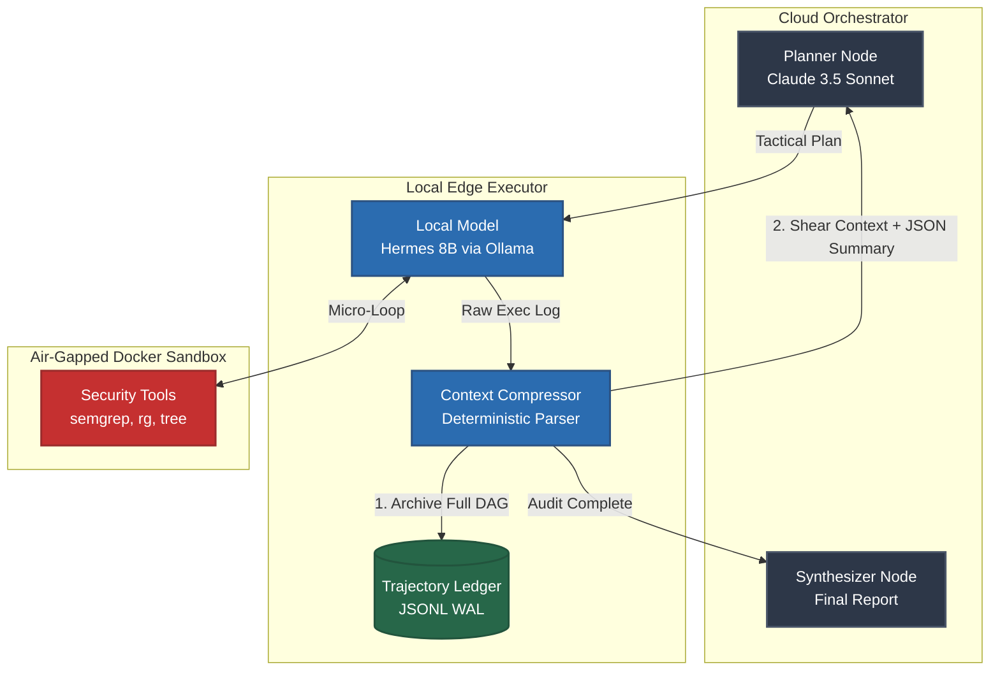

<div align="center">
  <!-- Optional Hero Image Placeholder: Replace the src with a real banner image if you design one in Figma/ComfyUI -->
  

  <h1>🛡️ CipherLoop</h1>
  <p><b>A Context-Compressed, Privacy-Preserving Hybrid Code Auditing Agent</b></p>

  <a href="https://python.org"></a>
  <a href="https://docker.com"></a>
  <a href="https://ollama.com"></a>
  <a href="https://anthropic.com"></a>
</div>

<br>

CipherLoop is an experimental cybersecurity agent framework designed to autonomously hunt for complex attack chains in massive codebases. It utilizes a **hybrid local/cloud LangGraph architecture** to solve the two biggest blockers in AI security auditing: context collapse and data privacy.

---

## 🧠 The Architecture (How It Works)



## ⚠️ The Research Problem: Context Collapse

Modern LLM agents excel at logical reasoning but fail catastrophically during extensive codebase audits. When agents passively ingest massive outputs from static analysis tools (`semgrep`, `ripgrep`, AST parsers), their context windows quickly degrade. This leads to hallucinations, infinite loops, and "Lucky Passes" where the agent guesses a vulnerability without proof.

## 🛡️ The CipherLoop Solution

CipherLoop introduces a strict **Memory Hypervisor** and **Write-Ahead Log (WAL)** to decouple reasoning from tool execution:

1. **The Cloud Orchestrator (Strategic):** Claude 3.5 Sonnet handles high-level planning, vulnerability triage, and attack-chain synthesis. It **never** sees raw source code, only compressed metadata.
2. **The Tactical Executor (Local):** Hermes 8B operates high-volume micro-loops executing `ripgrep`, `tree`, and `semgrep`. Its context is aggressively sheared, keeping it hyper-focused on immediate tactical horizons.
3. **The Air-Gapped Sandbox:** Tool execution occurs inside a dynamic Docker container with `network_mode: none` and read-only volume mounts, mathematically preventing the agent from modifying the codebase or exfiltrating data.
4. **The Context Compressor & WAL:** Raw `stdout` is intercepted. The exact sequence of events is appended to an immutable JSONL Trajectory Ledger, while the active graph memory is deterministically parsed, capped, and swept of noise using LangGraph's `RemoveMessage` reducer.

---

## 🚀 Quick Start

### Prerequisites

* **Python 3.11+**
* **Docker Engine** (running locally)
* **Ollama** (running locally with your preferred quant, default: `hermes3:8b`)
* **Anthropic API Key**

### 1. Installation

Clone the repository and set up your virtual environment:

```bash
git clone [https://github.com/jayjz/CipherLoop.git](https://github.com/jayjz/CipherLoop.git)
cd CipherLoop

# Create and activate virtual environment
python3 -m venv venv
source venv/bin/activate

# Install in editable mode with dev dependencies
pip install -e ".[dev]"

```

### 2. Configuration

Copy the environment template and add your API key:

```bash
cp .env.example .env
# Edit .env and insert your ANTHROPIC_API_KEY

```

Ensure Ollama has the execution model pulled:

```bash
ollama pull hermes3:8b

```

### 3. Execution

Launch the CLI against a target directory. CipherLoop will automatically provision the secure Docker sandbox, mount the target, and begin the audit.

```bash
python -m cipherloop.main audit ./path/to/target/repo --plan "Hunt for hardcoded credentials and remote code execution."

```

---

## 📚 TraceForge Integration (Evaluation)

CipherLoop is explicitly designed for deterministic evaluation. By utilizing a Write-Ahead Log (WAL), every run outputs a chronological `trajectory_<run_id>.jsonl` file in the `./traces/` directory.

These DAG traces capture every thought, tool call, error, and compressed finding. They are formatted specifically to be ingested by **[TraceForge](https://github.com/jayjz/TraceForge)** to evaluate whether the agent's findings are grounded in valid, safe, and recoverable processes, preventing the "vibes-based" grading common in AI security tooling.

## 🔒 Security Notice

Do **NOT** mount live production credentials or highly sensitive data into the target directory unless you understand the risks. While the sandbox is air-gapped (`network_mode: none`), the local LLM will parse the files it is instructed to read.

```

---
