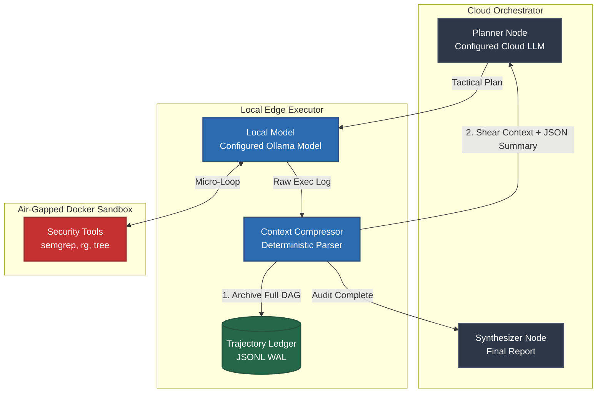

<div align="center">
  <!-- Optional Hero Image Placeholder: Replace the src with a real banner image if you design one in Figma/ComfyUI -->
  

  <h1>🛡️ CipherLoop</h1>
  <p><b>A Context-Compressed, Privacy-Preserving Hybrid Code Auditing Agent</b></p>

  <a href="https://python.org"></a>
  <a href="https://docker.com"></a>
  <a href="https://ollama.com"></a>
  <a href="https://langchain.com"></a>
</div>

<br>

CipherLoop is an experimental cybersecurity agent framework designed to autonomously hunt for complex attack chains in massive codebases. It utilizes a **hybrid local/cloud LangGraph architecture** to solve the two biggest blockers in AI security auditing: context collapse and data privacy.

---

## 🧠 The Architecture (How It Works)



## ⚠️ The Research Problem: Context Collapse

Modern LLM agents excel at logical reasoning but fail catastrophically during extensive codebase audits. When agents passively ingest massive outputs from static analysis tools (`semgrep`, `ripgrep`, AST parsers), their context windows quickly degrade. This leads to hallucinations, infinite loops, and "Lucky Passes" where the agent guesses a vulnerability without proof.

## 🛡️ The CipherLoop Solution

CipherLoop introduces a strict **Memory Hypervisor** and **Write-Ahead Log (WAL)** to decouple reasoning from tool execution:

1. **The Cloud Orchestrator (Strategic):** A configured Anthropic, OpenAI, or xAI model handles high-level planning, vulnerability triage, and report synthesis. It receives compressed findings rather than raw tool output.
2. **The Tactical Executor (Local):** A configured Ollama model runs high-volume micro-loops over `ripgrep`, `tree`, and `semgrep`. The active message state is swept after compression to keep tactical context bounded.
3. **The Air-Gapped Sandbox:** Tactical tools execute in a Docker container with `network_mode: none` and a read-only target mount. This reduces attack surface; before reuse, CipherLoop verifies the container's resolved target-mount identity and replaces stale bindings to prevent cross-contamination.
4. **The AST Evidence Validator:** `validator_node` uses Python's `ast.NodeVisitor` for conservative, intra-procedural taint tracking. A finding is verified only when it can prove a `source -> flow -> sink` path (for example, `request.args.get -> variable -> subprocess.run`); regex sink heuristics are not used.
5. **The Context Compressor & WAL:** Raw `stdout` is retained in the append-only JSONL trajectory ledger, while active graph memory is deterministically summarized and swept with LangGraph's `RemoveMessage` reducer.

---

## AST Validator

Before deep analysis or transformation, the AST (Abstract Syntax Tree) Validator parses the target source and verifies that its structure is safe for downstream processing. It confirms syntax correctness before execution, identifies malformed, unsupported, or unsafe AST nodes early, and prevents engine crashes or undefined behavior caused by invalid input.

## Semgrep Fallback Mechanism

CipherLoop keeps scans available when native AST processing cannot safely continue—for example, when it encounters syntax errors, partial snippets, or unsupported language constructs.

1. **Primary pass:** The native engine attempts AST parsing and validation.
2. **Fallback trigger:** If parsing or validation fails with a recoverable syntax error, CipherLoop logs a non-fatal warning explaining the trigger and routes the source to Semgrep fallback mode.
3. **Secondary pass:** Semgrep runs pattern matching against the source text, preserving scan coverage without failing the pipeline.

This graceful fallback supports continuous coverage for partial and legacy codebases while avoiding unnecessary CI/CD pipeline failures.

```text
[ Source Code ]
       |
       v
[ AST Validator ] ---- (Valid) ----------> [ Native Engine Analysis ]
       |
   (Invalid /
   Unsupported)
       |
       v
[ Semgrep Fallback ] --------------------> [ Pattern-based Results ]
```

---

## 🚀 Quick Start

### Prerequisites

* **Python 3.11+**
* **Docker Engine** (running locally)
* **Ollama** (running locally with the model named by `OLLAMA_MODEL`)
* **Credentials for the configured cloud provider** (`anthropic`, `openai`, or `xai`)

### 1. Installation

Clone the repository and set up your virtual environment:

```bash
git clone [https://github.com/jayjz/CipherLoop.git](https://github.com/jayjz/CipherLoop.git)
cd CipherLoop

# Create and activate virtual environment
python3 -m venv venv
source venv/bin/activate

# Install in editable mode with dev dependencies
pip install -e ".[dev]"

```

### 2. Configuration

Copy the environment template and select a cloud provider, cloud model, and local Ollama model:

```bash
cp .env.example .env
# Edit .env: set the selected provider's API key/model and OLLAMA_BASE_URL/OLLAMA_MODEL

```

Ensure Ollama has the execution model pulled:

```bash
ollama pull <your OLLAMA_MODEL value>

```

### 3. Execution

Launch the CLI against a target directory. CipherLoop verifies any existing sandbox's resolved target mount before reuse; a mismatched binding is replaced before the audit begins.

```bash
python -m cipherloop.main audit ./path/to/target/repo --plan "Hunt for hardcoded credentials and remote code execution."

```

---

## 📚 TraceForge Integration (Evaluation)

CipherLoop is designed for deterministic evaluation. Every run emits a chronological `trajectory_<run_id>.jsonl` ledger and a `metadata_<run_id>.json` summary in `./traces/`.

The `TrajectoryRecorder` records tool-level `raw_char_count` and `compressed_char_count`, then calculates the run-wide compression ratio in metadata. Validation events also record total candidates, verified findings, and the candidate-to-verified ratio. These measurements can be ingested by **[TraceForge](https://github.com/jayjz/TraceForge)** to evaluate compression efficiency and evidence quality empirically.

## 🔒 Security Notice

Do **NOT** mount live production credentials or highly sensitive data into the target directory unless you understand the risks. While the sandbox is air-gapped (`network_mode: none`), the local LLM will parse the files it is instructed to read.

---
